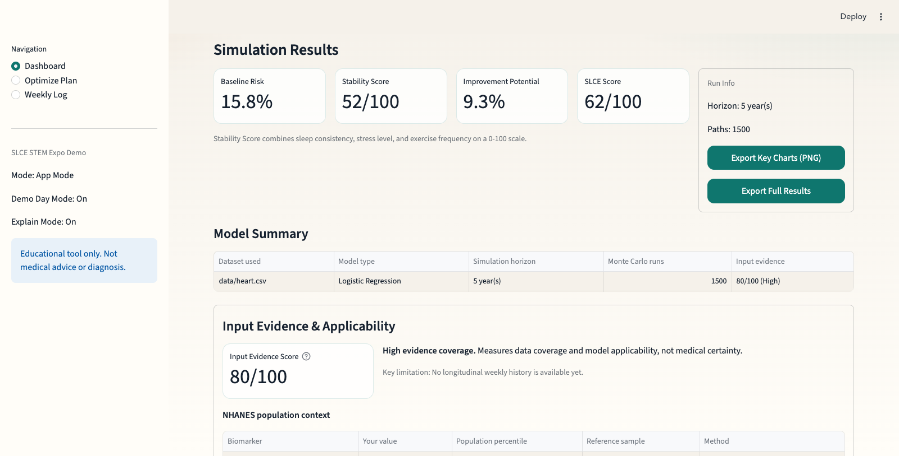
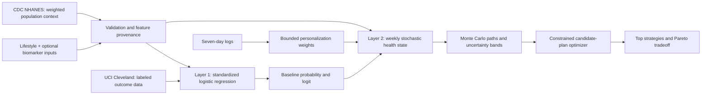
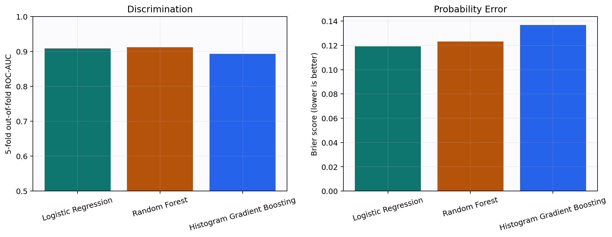
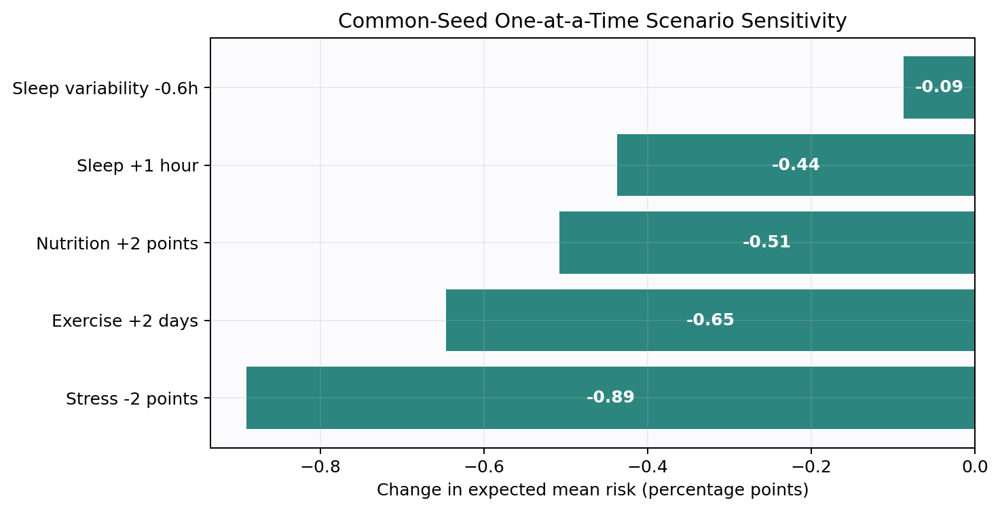
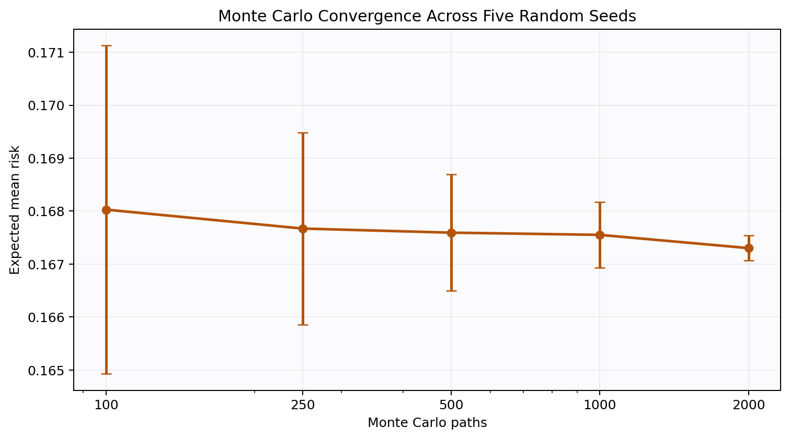
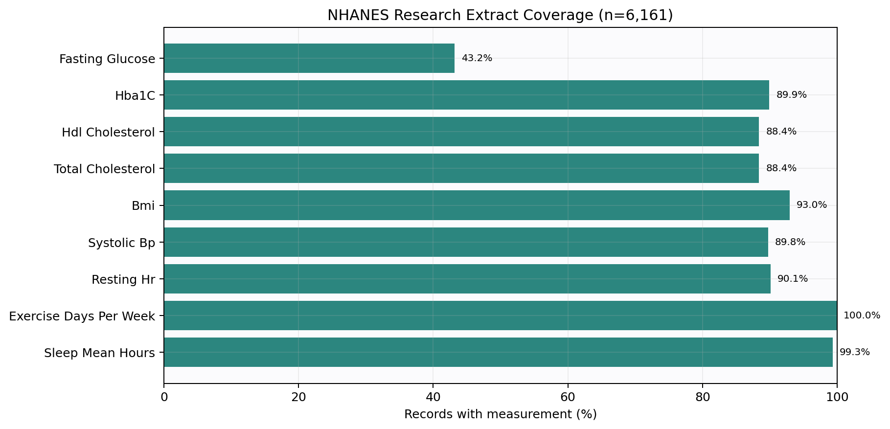

# SLCE: Stochastic Lifestyle Control Engine

[](https://github.com/drivera-b/SCLE/actions/workflows/tests.yml)

SLCE turns lifestyle and optional biomarker inputs into an evidence-aware baseline risk, simulates thousands of possible health trajectories, and searches for feasible habit plans under time and adherence constraints.

> Educational research prototype only. Not medical advice or diagnosis. Scenario differences are model outputs, not causal treatment-effect estimates.



## Why This Project Exists

Most wellness dashboards report a single score. SLCE treats the decision as an uncertainty and control problem:

1. Estimate a clinical baseline from a real labeled dataset.
2. Propagate lifestyle uncertainty through weekly stochastic dynamics.
3. Compare many possible futures instead of presenting one deterministic forecast.
4. Optimize changes that fit the user's available time and gradual-change limits.
5. Expose input provenance, assumptions, and out-of-distribution limitations.

## 60-Second Product Tour

- **Dashboard:** choose a demo profile or enter lifestyle and optional lab values, then run 500-5,000 Monte Carlo paths.
- **Decision support:** inspect baseline risk, uncertainty bands, the SLCE Score, sensitivity-ranked levers, and plain-English takeaways.
- **Optimize Plan:** evaluate up to 90 screened candidate strategies with common random numbers and view the risk/time Pareto tradeoff.
- **Weekly Log:** enter seven days of observations and update bounded personalization weights.
- **Research Mode:** inspect equations, model parameters, feature provenance, assumptions, and evidence coverage.

## System Architecture



The datasets are deliberately **not** row-concatenated. UCI supplies a compatible supervised heart-disease label; NHANES supplies survey-weighted reference context and objective biomarker coverage.

## Worked Example

The committed example is reproducible from `reports/worked_example.json` using the measured adult demo profile, a five-year horizon, 1,500 dashboard paths, and a 40-minute/day plan budget.

| Output | Result |
|---|---:|
| Layer 1 baseline probability | 15.77% |
| Unchanged-lifestyle mean simulated risk | 17.79% |
| Final-risk 5th-95th percentile interval | 13.50%-23.95% |
| Candidates evaluated | 90 |
| Balanced plan mean simulated risk | 14.45% |
| Modeled improvement vs. unchanged scenario | 3.29 percentage points |
| Balanced plan time estimate | 30 min/day |

The simulation starts exactly at the Layer 1 probability. Later risk moves relative to that individual anchor, and conservative weekly drift prevents lifestyle assumptions from overwhelming the clinical baseline over long horizons.

## Validation Evidence

### Baseline model comparison

Five-fold stratified out-of-fold evaluation on all 303 UCI Cleveland rows:

| Model | ROC-AUC | Accuracy | Brier score |
|---|---:|---:|---:|
| Logistic Regression (production) | 0.908 | 0.832 | 0.119 |
| Random Forest | 0.912 | 0.838 | 0.123 |
| Histogram Gradient Boosting | 0.893 | 0.818 | 0.137 |

The logistic model remains the production baseline because it has the best probability error of the compared models, nearly matches the best discrimination, and is easier to audit. Its bootstrapped 95% ROC-AUC interval is 0.875-0.939.



### Scenario sensitivity and numerical stability

The sensitivity analysis changes one input at a time while holding the model seed fixed. This isolates model response rather than claiming causality.





Across five seeds, the standard deviation of the expected-risk estimate falls from about `0.0031` at 100 paths to `0.00024` at 2,000 paths.

### Data coverage



- `data/heart.csv`: UCI Cleveland Heart Disease, 303 labeled rows, CC BY 4.0.
- `data/nhanes_lifestyle_biomarkers.csv`: CDC NHANES 2017-2018 extract, 6,161 records.
- `data/demo_sample.csv`: offline fallback for first-run reliability.
- `models/baseline_model.joblib`: bundled pretrained artifact with JSON metadata.

## Modeling Details

Weekly state update:

`H[t+1] = clamp(H[t] + conservative_lifestyle_drift + reversion_to_start + noise, 0, 100)`

Risk mapping:

`p[t] = sigmoid(baseline_logit + beta * (H[0] - H[t]) / 100)`

Optimizer objective:

`objective = expected_mean_risk + lambda_time * time_cost - lambda_adherence * adherence`

- Noise increases with stress and sleep variability.
- Candidate plans ramp gradually toward sleep, activity, stress, nutrition, and consistency targets.
- Every plan uses the same random seed during comparison to reduce Monte Carlo ranking noise.
- Measured systolic blood pressure, cholesterol, and fasting glucose can replace proxy/imputed UCI features.
- HbA1c and BMI are used for NHANES context only, not assigned unsupported classifier coefficients.

See [`research/methodology.md`](research/methodology.md) and [`research/assumptions_and_limitations.md`](research/assumptions_and_limitations.md).

## Run Locally

### No-terminal launchers

**macOS**

1. Download and extract the GitHub ZIP.
2. Double-click `SETUP_MAC.command` once.
3. Double-click `RUN_SLCE_MAC.command` whenever you want to run SLCE.

**Windows**

1. Download and extract the GitHub ZIP.
2. Double-click `SETUP_WINDOWS.bat` once.
3. Double-click `RUN_SLCE_WINDOWS.bat` whenever you want to run SLCE.

**PyCharm on macOS or Windows**

1. Open the project folder and select Python 3.10 or 3.11.
2. Install `requirements.txt` in the selected interpreter.
3. Run `RUN_SLCE_PYCHARM.py`.

### Developer path

```bash
python -m venv .venv
source .venv/bin/activate  # Windows: .venv\Scripts\activate
python -m pip install -r requirements.txt
python -m streamlit run app.py
```

For an instant measured-profile demonstration, open `http://localhost:8501/?demo=research` after launch.

School-managed devices may block package installation or localhost. Use the browser-only deployment procedure in [`STEM_EXPO_DOCS/streamlit_cloud_backup.md`](STEM_EXPO_DOCS/streamlit_cloud_backup.md) and test it before presentation day.

## Reproduce the Research

```bash
# Run tests
python -m pytest -q

# Retrain the baseline from bundled real data
python -m src.baseline_model --train

# Regenerate figures, metrics, and the worked example
python -m scripts.generate_research_figures

# Rebuild NHANES from official CDC XPT modules (internet required)
python -m src.nhanes_dataset --build
```

## Reliability Design

- Bundled UCI and processed NHANES datasets support offline demonstrations.
- Missing model artifacts trigger local retraining or a bounded heuristic fallback.
- Validation and clamping cover every user-facing numeric input.
- User-facing model and simulation failures are caught and displayed without stack traces.
- Experiment CSV logs and exported PNG charts support auditability and expo documentation.
- GitHub Actions runs the automated tests and verifies model loading on every push.

## Known Limitations

- UCI Cleveland is small and covers ages 29-77; teen predictions are explicitly marked out-of-distribution.
- Lifestyle coefficients are transparent directional assumptions, not learned causal effects.
- Monte Carlo bands cover uncertainty under the specified model, not all real-world uncertainty.
- NHANES percentiles use examination weights, but the app does not yet compute full survey-design standard errors.
- Weekly-log personalization is a bounded adaptive heuristic, not online causal inference.

## Repository Map

- `app.py`: Streamlit product UI with Dashboard, Optimize Plan, and Weekly Log pages.
- `src/`: data ingestion, baseline model, simulation, optimization, personalization, validation, and plots.
- `scripts/`: reproducible research-output generation.
- `tests/`: unit and Streamlit smoke tests.
- `research/`: methodology and limitations.
- `reports/`: screenshots, figures, metrics, and worked example.
- `STEM_EXPO_DOCS/`: demo runbook, testing checklist, logbook, tri-fold layout, and provenance.

Dataset citations and licenses are documented in [`STEM_EXPO_DOCS/dataset_provenance.md`](STEM_EXPO_DOCS/dataset_provenance.md).
