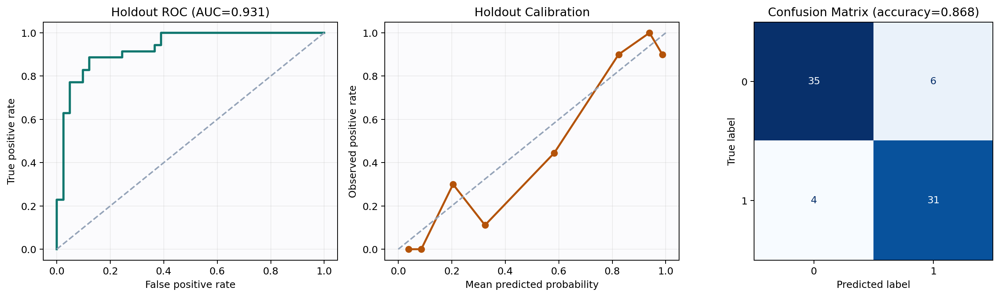

# SLCE: Stochastic Lifestyle Control Engine


SLCE is a decision-support app that combines supervised learning, stochastic simulation, and constrained optimization to estimate long-term health risk under uncertainty.

This repository is intentionally packaged for reliable first-run behavior on new machines and live demos.

## Quant/Engineering Highlights
- Two-layer modeling system with baseline ML plus stochastic state simulation
- Baseline risk model from real public data (`LogisticRegression` on UCI Cleveland heart dataset features)
- Weekly stochastic state model (`H_t`) with Monte Carlo uncertainty propagation
- Constrained plan optimization with explicit objective and feasibility rules
- Adaptive personalization from weekly logs (weight updates based on observed trend direction)
- Optional measured biomarkers with observed/proxy/imputed feature provenance
- CDC NHANES research pipeline with 6,161 processed lifestyle and biomarker records
- Input Evidence Score that exposes data coverage and out-of-distribution age limitations
- Defensive runtime design with input validation, clamping, and fallback logic
- Graceful fallback to local demo data/model paths
- Cached model/dataset status and friendly error messaging
- Verified test suite (`pytest`) for core validation and stochastic logic

## Modeling Overview
- Latent health state update (weekly):
`H_{t+1} = clamp(H_t + drift(features, plan) + noise, 0, 100)`
- Weekly risk mapping:
`p_t = sigmoid(alpha + beta * (100 - H_t)/100 + baseline_logit)`
- Optimizer objective:
`objective = expected_mean_risk + lambda_time * time_cost - lambda_adherence * adherence_score`

## Data and Artifacts
- Real dataset included: `data/heart.csv` (UCI Cleveland format, cleaned, 303 rows)
- Research/reference dataset: `data/nhanes_lifestyle_biomarkers.csv` ([CDC NHANES 2017-2018](https://wwwn.cdc.gov/nchs/nhanes/continuousnhanes/overview.aspx?BeginYear=2017), 6,161 rows)
- NHANES fields include sleep, activity, blood pressure, BMI, cholesterol, HbA1c, and fasting glucose
- Fallback dataset: `data/demo_sample.csv`
- Pretrained baseline artifacts: `models/baseline_model.joblib`, `models/baseline_metadata.json`

The two datasets are not naively concatenated. UCI provides the supervised heart-disease label; NHANES provides population-reference context and a richer future-model research dataset.

Current baseline holdout metrics (from metadata):
- Accuracy: `0.8684`
- ROC-AUC: `0.9310`
- Confusion matrix: `[[35, 6], [4, 31]]`

## Research Evidence




Regenerate all figures and machine-readable metrics:
```bash
python -m scripts.generate_research_figures
```

## Quick Start (No Terminal Required)

### macOS
1. Download ZIP from GitHub and extract.
2. Double-click `SETUP_MAC.command` (first time only).
3. Double-click `RUN_SLCE_MAC.command`.

### Windows
1. Download ZIP from GitHub and extract.
2. Double-click `SETUP_WINDOWS.bat` (first time only).
3. Double-click `RUN_SLCE_WINDOWS.bat`.

### PyCharm (Mac/Windows)
1. Open project folder in PyCharm.
2. Use Python `3.10` or `3.11` interpreter.
3. Install from `requirements.txt`.
4. Run `RUN_SLCE_PYCHARM.py`.

If school-managed laptops block localhost (`127.0.0.1`), use the Streamlit Cloud backup flow in `STEM_EXPO_DOCS/streamlit_cloud_backup.md`.

## CLI Setup (Developer Path)
```bash
pip install -r requirements.txt
streamlit run app.py
```

## Reproducibility Commands
Train/retrain baseline model:
```bash
python -m src.baseline_model --train
```

Run tests:
```bash
pytest -q
```

Rebuild the NHANES research extract directly from official CDC XPT modules:
```bash
python -m src.nhanes_dataset --build
```

## Repository Layout
- `app.py` Streamlit application (Dashboard, Optimize Plan, Weekly Log)
- `src/` core modeling and public-data pipeline modules
- `data/` bundled UCI, NHANES, and fallback datasets
- `models/` model artifact and metadata
- `research/` methodology, assumptions, and limitations
- `reports/` generated research figures and metrics
- `scripts/` reproducible report generation
- `tests/` unit tests
- `.github/workflows/tests.yml` continuous integration
- `STEM_EXPO_DOCS/` runbook, testing checklist, logbook, tri-board layout, data provenance

## Reliability Guarantees in This Repo
- Works without internet using bundled `data/heart.csv` and `models/baseline_model.joblib`
- Bundles a processed NHANES research extract while keeping a reproducible download/build pipeline
- Auto-fallback to `data/demo_sample.csv` if needed
- Heuristic baseline fallback if model artifact is unavailable
- Makes observed, proxy-derived, and median-imputed model features visible in Research Mode
- Explicit validation and friendly user-facing failures instead of raw stack traces

## Safety
Educational tool only. Not medical advice or diagnosis.

## Dataset Provenance
See `STEM_EXPO_DOCS/dataset_provenance.md` for source, DOI, and licensing details.

Research design details are in `research/methodology.md` and `research/assumptions_and_limitations.md`.
